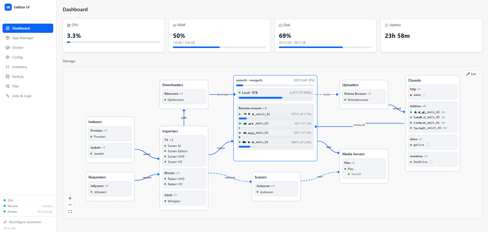
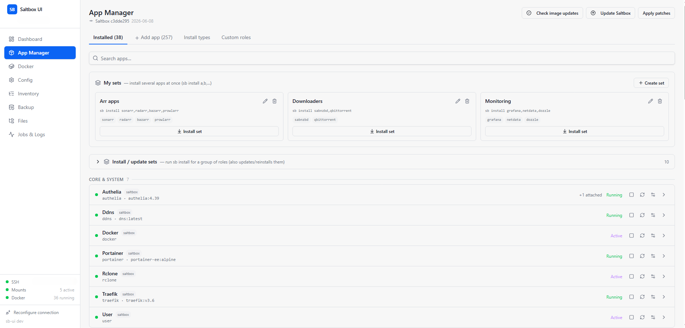
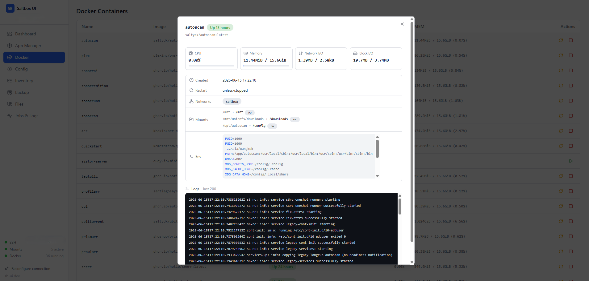

<div align="center">

# Saltbox UI (`sb-ui`)

**A single-binary web control panel for [Saltbox](https://saltbox.dev).**
Manage apps, Docker, storage, mounts and config from one fast Go binary with an embedded React UI.

<!-- TODO: add badges once repo is public -->
<!--    -->



</div>

---

## What is this?

`sb-ui` is a **Go** web control panel for Saltbox. The whole thing — HTTP API,
WebSocket log streaming, and the compiled React frontend — ships as **one static
binary** with no runtime dependencies. It talks to your Saltbox host either
**locally** or over **SSH**, running the same CLI commands you would (`sb`,
`docker`, `rclone`, `systemctl`, `findmnt`, …) and surfacing the results in a
live UI.

> **Status:** Phases 0–7 ✅ complete and verified against a real Saltbox host
> over SSH.

## Features

| | |
|---|---|
| 🗺️ **Live storage flow** | Interactive React Flow diagram of the whole pipeline — indexers → downloaders → importers → unionfs (local + remote mounts) → media servers → cloud remotes. Live capacity, mount liveness, hover for details. Editable layout in dev. |
| 📦 **App Manager** | Install / reinstall / pull / remove Saltbox + Sandbox apps, grouped by category, with per-instance status, image-update detection, and the **Install Types** picker built in. |
| 🐳 **Docker** | All containers in one place with **live CPU / MEM**, start/stop/restart, and a detail drawer (inspect, networks, mounts, env, logs). One cached `docker ps` feeds every view. |
| 🔌 **Always-on status bar** | SSH/local connection, mount liveness (per-mount, stale detection), and Docker daemon — visible on every page. |
| ⚙️ **Config & Inventory** | Edit `accounts.yml` / `settings.yml` / inventory with apply hooks. |
| 🧩 **Role Builder** | Scaffold and edit custom `saltbox_mod` roles + patches from the UI. |
| 💾 **Backup · Files** | Browse appdata, manage files, backup config. |
| 🔄 **In-UI self-update** | One click swaps the binary to the latest release and restarts. |

<div align="center">

| App Manager | Docker detail |
|:---:|:---:|
|  |  |

</div>

## Architecture

```
┌────────────────────────── sb-ui (one binary) ──────────────────────────┐
│  React SPA  ──embed──►  chi HTTP router  ──►  executor abstraction       │
│  (frontend/)            /api  +  /ws            ├─ Local  (exec)         │
│                                                 └─ SSH    (x/crypto/ssh) │
└───────────────────────────────────────────────────────┬─────────────────┘
                                                          ▼
                                   sb · docker · rclone · systemctl · findmnt
                                          (on the Saltbox host)
```

- **Executor** — every host action goes through one interface, so local and SSH
  modes share identical code paths.
- **Single docker source** — `docker ps -a` is fetched once and cached (short
  TTL); the container list, app list, and status bar all derive from it.

## Install

Two paths — pick one.

### A. Standalone (any host)

```bash
curl -fsSL https://raw.githubusercontent.com/totza2010/sb-ui/master/install.sh | sudo bash
```

Binary → `/opt/saltbox-ui`, raw systemd unit, listens on `:8000`. No Traefik /
SSO / DNS. Open `http://<host>:8000` and run the setup wizard.

```bash
systemctl status sb-ui      # status
journalctl -u sb-ui -f      # logs
```

### B. Saltbox-native (mod role) — recommended on a Saltbox host

Installs sb-ui as a [`saltbox_mod`](https://github.com/saltyorg/saltbox_mod) role
(modelled on the autoplow role): binary → `/srv/binaries/sbui`, with a Traefik
subdomain + Authelia SSO + DNS + a `saltbox_managed_sbui` systemd unit. Run as
**your Saltbox user** (not root):

```bash
curl -fsSL https://raw.githubusercontent.com/totza2010/sb-ui/master/bootstrap-mod.sh | bash
```

It ensures `saltbox_mod` is installed, drops the versioned role tarball into
`/opt/saltbox_mod/roles/sbui`, registers it in `saltbox_mod.yml`, and runs
`sb install mod-sbui`. Reachable at `https://sbui.<your-domain>` (or your apex,
if no subdomain is configured).

### Updating

| Method | Path | What it does |
|---|---|---|
| **In-UI button** | A & B | Sidebar shows *"Update to vX.Y.Z"* when a newer release exists — swaps the binary in place and restarts. |
| `sb install mod-sbui` | B | Re-pulls the latest binary and re-applies Traefik / DNS / systemd. |
| Re-run `bootstrap-mod.sh` | B | When the **role itself** changes (tasks/defaults) — fetches the new role tarball, then run `sb install mod-sbui`. |

## Configuration

### Connecting to the host

On first launch the UI shows a **Connection Setup** screen (local or SSH). It
writes a `.env` next to the binary:

| Variable | Meaning | Default |
|---|---|---|
| `SALTBOX_CONFIGURED` | gate that marks setup complete | — |
| `SALTBOX_HOST` | SSH host (empty = local mode) | _empty_ |
| `SALTBOX_PORT` | SSH port | `22` |
| `SALTBOX_USER` | SSH user | `seed` |
| `SALTBOX_KEY` | SSH private key path | `~/.ssh/id_rsa` |
| `SALTBOX_PASSWORD` | password auth (instead of key) | — |
| `SALTBOX_PASSPHRASE` | key passphrase | — |
| `SB_UI_ADDR` | listen address | `:8000` |

> ⚠️ **Never commit `.env`** — it can hold SSH passwords. It is gitignored;
> use `.env.example` as a template.

You can re-link to a different host any time via **Reconfigure connection** in
the sidebar footer.

### Setting up Saltbox itself

A fresh box also shows the **Setup Wizard** (install type → accounts → settings).
Once `accounts.yml` has a real domain + username, the wizard disappears from the
nav automatically — it only matters on an un-provisioned box.

> **Note on rclone:** `rclone.conf` is read from the **Saltbox user's** home
> (`accounts.yml → user.name`), not the SSH/connection user — mirroring
> Saltbox's own `rclone_config_path`.

## Development (hot reload)

Two watchers run together — no rebuilding the binary by hand:

- **Vite** serves the React app with HMR on `http://localhost:5173` and proxies
  `/api` + `/ws` → the Go backend on `:8000`.
- **[air](https://github.com/air-verse/air)** rebuilds + restarts the Go backend
  (~1s) on any `.go` change, reading `.env` for the connection.

```powershell
./dev.ps1          # Windows — starts both, open http://localhost:5173
```

Or in two terminals:

```bash
air                          # Go backend, hot-reload, :8000   (go install github.com/air-verse/air@latest)
cd frontend && npm run dev   # Vite + HMR, :5173
```

> The diagram layout is **editable only in dev** (an *Edit* button appears); the
> production default layout is baked into the code.

## Build & Release

```bash
./build.sh                  # linux/amd64 (Saltbox target)
./build.sh linux arm64      # arm release
./build.sh windows amd64    # dev build
VERSION=v0.7.0 ./build.sh   # bake an explicit version
```

`build.sh` runs `npm run build`, copies `frontend/dist` → `web/` for embedding,
and bakes the version (`-X sb-ui/internal/buildinfo.Version`). A bare `go build`
also works (embeds whatever is in `web/`).

Tag `vX.Y.Z` (or run the workflow manually) to build + publish the linux
amd64/arm64 binaries, the `sb-ui-role.tar.gz` mod role, and checksums —
`.github/workflows/release.yml`.

## Troubleshooting

| Symptom | Cause / Fix |
|---|---|
| **Frontend loads but shows "backend offline"** | The Go backend isn't reachable. Check `systemctl status sb-ui` (or that `air` is running in dev). The UI auto-recovers when it comes back. |
| **Status bar: Docker "down"** | The connection user can't reach the Docker socket. Ensure it's in the `docker` group, or run as the Saltbox user. |
| **Mounts show "not responding"** | An rclone mount went stale (`timeout 2 ls` failed). Restart the mount's `systemctl` unit. |
| **rclone remotes empty / wrong** | `rclone.conf` is read from `accounts.yml → user.name`'s home. Verify that user actually owns the config. |
| **`bootstrap-mod.sh`: `ansible.builtin.include_role: roles_path` invalid** | A stale `pre_tasks` role in `/opt/saltbox_mod/roles` — remove it and re-run. |
| **`ansible_architecture` undefined during install** | `saltbox_mod` sets `inject_facts_as_vars=False`; the role uses `ansible_facts['architecture']` — make sure you're on the current role tarball (re-run bootstrap). |
| **`vite` not recognized (dev)** | Run `npm install` in `frontend/` first. |
| **air drops the watch after a save (Windows)** | fsnotify breaks on atomic-save temp files; `.air.toml` already sets `poll = true`. Make sure you didn't override it. |

## Roadmap

| Phase | Focus |
|---|---|
| 0–3 ✅ | Foundations — single-binary server, executor (local/SSH), jobs + WebSocket log streaming, App Manager, config/inventory, embedded React UI |
| 4–5 ✅ | Setup wizard, role creation wizard, rclone + mounts, always-on status bar |
| 6 ✅ | Live storage flow diagram, deep Docker page (live stats + detail drawer) |
| 7 ✅ | Distribution — versioned releases, standalone installer, `saltbox_mod` role, in-UI self-update, single-source Docker data |
| **8 — Custom role management** 🚧 | Full lifecycle for user `saltbox_mod` roles in the App Manager **Custom roles** tab — list / create / configure / edit files / reinstall / remove (sb-ui's own role excluded). Built; **needs thorough end-to-end testing** on a live host (see checklist below). |
| **9 — Per-app live metrics** | Surface real app data in the flow & drawers: qBittorrent active torrents, *arr queue depth, Plex active streams |
| **9.5 — autoplow integration** | Wire up [autoplow](https://github.com/saltyorg/autoplow) (the Go successor to Autoscan + Cloudplow) — manage and monitor its scans/uploads from the flow diagram |
| **10 — Alerts & notifications** | Push on mount-stale / container-down / failed jobs (webhook / Discord / Apprise) |
| **11 — History & trends** | Sparklines for CPU/RAM/disk and mount usage over time |
| **12 — Multi-host** | Manage several Saltbox hosts from one UI |
| **13 — Standalone auth** | Built-in login / RBAC for path A (no Authelia) |

> 🚧 = built but not yet verified end-to-end. Suggestions welcome — open an issue.

### Phase 8 — testing checklist (custom roles)

The custom-role flow works in the UI but hasn't been hardened against a real host yet. To verify:

- [ ] `saltbox_mod` path is correct (`/opt/saltbox_mod`) — Custom roles tab lists existing roles, and `sbui` is hidden
- [ ] **Create**: wizard writes the role to `/opt/saltbox_mod/roles/<name>` and registers it in `saltbox_mod.yml` with correct indentation
- [ ] **Create → Commit & Install** runs `mod-<name>` and the container comes up
- [ ] **Configure**: inventory variables + `defaults`/`tasks`/`templates` read & write through `repo=mod` (correct paths, patches persist)
- [ ] **Reinstall** (`mod-<name>`) succeeds
- [ ] **Remove**: stops/removes the container, deletes the role folder, unregisters from `saltbox_mod.yml`; app data untouched
- [ ] Edge cases: role-name validation, duplicate names, multi-instance roles

## Layout

```
main.go            # server + embed + SPA fallback + --version
internal/…         # Go backend (executor, jobs, apps, docker, api, …)
frontend/          # React source (Vite); develop here
web/               # embedded frontend build (generated; gitignored)
build.sh           # frontend build + copy + versioned go build
install.sh         # standalone host installer (binary + systemd)
bootstrap-mod.sh   # Saltbox-native installer (saltbox_mod role)
sb-ui.service      # standalone systemd unit template
deploy/saltbox_mod/roles/sbui/   # the mod role (autoplow-style), shipped as sb-ui-role.tar.gz
docs/screenshots/  # README images
```

## Credits

Built by [**totza2010**](https://github.com/totza2010).

Thanks to [**Saltbox**](https://github.com/saltyorg/Saltbox) — the media-server
automation this UI exists to drive, and its
[`saltbox_mod`](https://github.com/saltyorg/saltbox_mod) framework that path B
installs through.

Not affiliated with or endorsed by the Saltbox project — this is an independent
companion tool.

### Built with

Go · [chi](https://github.com/go-chi/chi) · [air](https://github.com/air-verse/air) ·
React · [Vite](https://vitejs.dev) · [Tailwind CSS](https://tailwindcss.com) ·
[shadcn/ui](https://ui.shadcn.com) · [React Flow](https://reactflow.dev)

## License

[MIT](LICENSE) © 2026 totza2010
